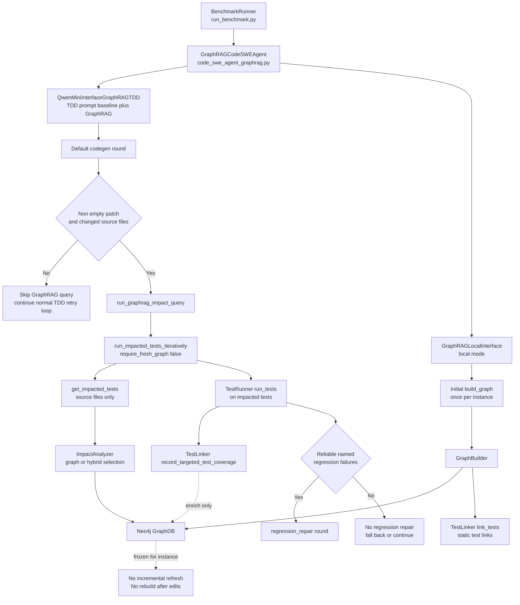
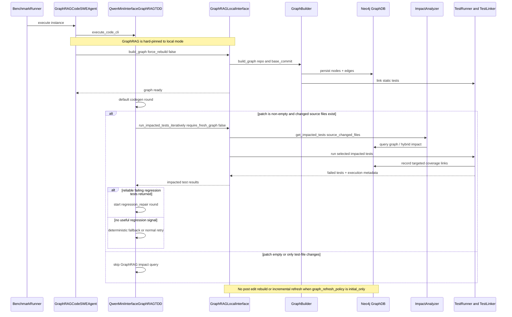
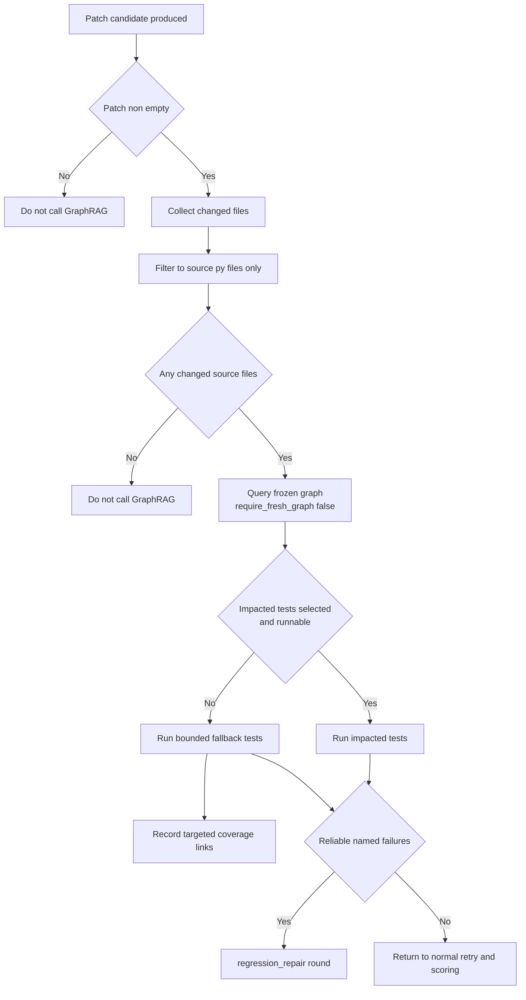
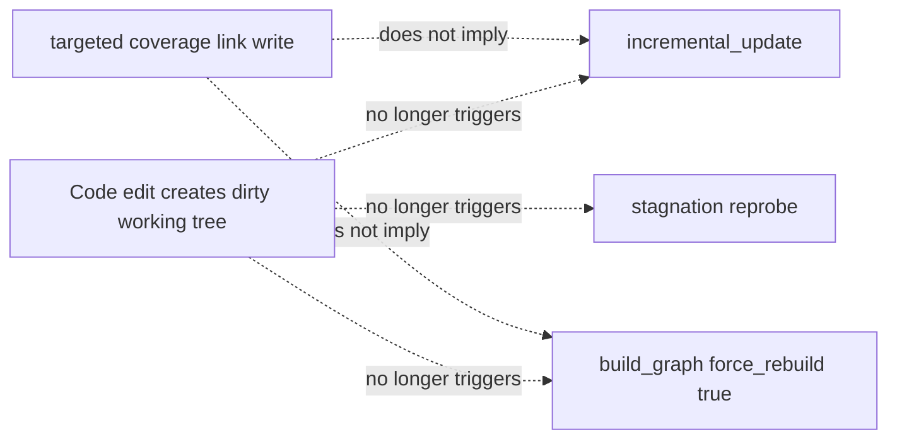

# GraphRAG TDD Agent Flow

This document shows the current `graphrag_tdd` architecture after the recent lifecycle change:

- the structural graph is built once per instance
- the graph is not re-indexed after code edits
- GraphRAG runs only on changed source files from a non-empty patch
- targeted coverage updates enrich graph links, but do not rebuild the graph

## 1. High-Level Component Flow

## 2. Single-Instance Sequence

## 3. Decision Logic

## 4. What No Longer Happens

## 5. Practical Reading Guide

- `run_benchmark.py`
  - chooses `graphrag_tdd`
  - applies effective controls
  - forces `graphrag_tool_mode=local`
  - sets `graph_refresh_policy=initial_only`
- `code_swe_agent_graphrag.py`
  - constructs the agent and passes GraphRAG config into the qwen-mini interface
- `utils/qwen_mini_interface.py`
  - runs the main attempt loop
  - decides when GraphRAG should be queried
  - starts `regression_repair` only when the returned regression signal is reliable
- `utils/graphrag_local_interface.py`
  - builds the graph once
  - serves impacted-test queries locally
  - records targeted coverage links after already-selected tests run
- `mcp_server/impact_analyzer.py`
  - selects impacted tests from the existing graph

If you want, I can add a second Markdown file that focuses only on the retry loop and shows where `default`, `test_repair`, `regression_repair`, and `compile_repair` connect. 
